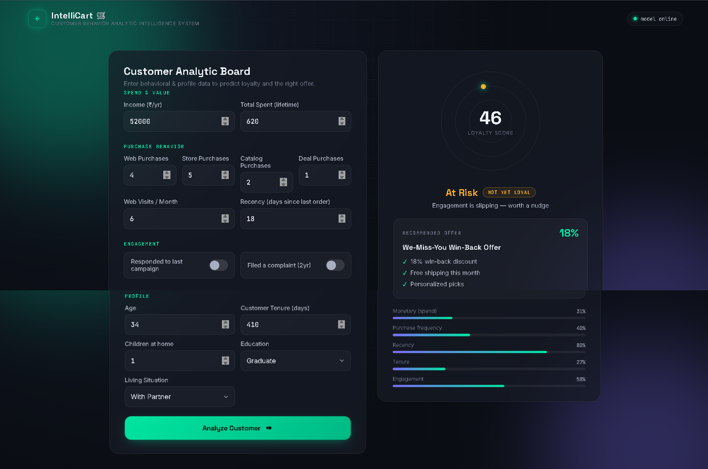

<div align="center">

# 🛒 ***IntelliCart AI***

### **Customer Behavior & Loyalty Intelligence System**

**Predict Customer Loyalty • Analyze Behavior • Identify At-Risk Customers • Recommend Personalized Offers**

<p align="center">


</p>

<p align="center">


</p>

<p align="center">

<a href="https://intellicart-cxm3.onrender.com" target="_blank">


</a>

</p>

</div>

---

### 📖 About IntelliCart AI

**IntelliCart AI** is a Machine Learning powered **Customer Behavior Analytics and Loyalty Intelligence System** designed to understand customer purchasing patterns and identify customers who may require targeted engagement.

The system analyzes customer information such as **income, spending, purchase frequency, web visits, recency, tenure, engagement, and demographic profile** to generate an intelligent customer assessment.

The dashboard provides:

* 🎯 Customer Loyalty Score
* ⚠️ Customer Risk Status
* 📊 Behavioral Analysis
* 💰 Monetary Value Analysis
* 🛍️ Purchase Frequency Analysis
* 📅 Recency Analysis
* 👤 Customer Profile Analysis
* 🎁 Personalized Offer Recommendation

The goal is to help businesses make **data-driven customer retention and marketing decisions**.

---

### 🌐 Live Demo 👉 [IntelliCart AI](https://intellicart-cxm3.onrender.com)

---

### 🖥️ Project Preview

<p align="center">



</p>

---

### 🎯 Project Summary

IntelliCart AI takes customer behavioral and profile information as input and generates an intelligent customer analysis.

### The user provides information such as:

#### 💰 Spend & Value

* Annual Income
* Total Lifetime Spending

#### 🛍️ Purchase Behavior

* Web Purchases
* Store Purchases
* Catalog Purchases
* Deal Purchases
* Web Visits per Month
* Recency

#### 📢 Engagement

* Campaign Response
* Complaint History

#### 👤 Customer Profile

* Age
* Customer Tenure
* Number of Children
* Education
* Living Situation

The system processes these attributes and produces a **loyalty score, customer risk category, behavioral indicators, and recommended marketing offer**.

---

### Key Features ✨

#### 🎯 Customer Loyalty Scoring

Generates a customer loyalty score based on behavioral and customer-value signals.

#### ⚠️ Customer Risk Detection

Identifies customers whose engagement or purchasing behavior indicates a potential risk of churn.

### 📊 Behavioral Analytics

Analyzes multiple dimensions of customer behavior:

* Monetary Spend
* Purchase Frequency
* Recency
* Customer Tenure
* Engagement

### 🎁 Personalized Offer Recommendation

Suggests an appropriate customer offer based on the customer's current behavioral profile.

Example:

> **We-Miss-You Win-Back Offer**

* Discount / Win-back incentive
* Free shipping
* Personalized recommendations

### 📈 Confidence & Score Visualization

Displays customer metrics using intuitive visual indicators and progress bars.

### 🎨 Modern Analytics Dashboard

A dark, modern dashboard provides a clean interface for entering customer information and understanding the generated results.

### ⚡ Real-Time Analysis

Customer information can be analyzed interactively and the resulting customer insights are displayed immediately.

### 📱 Responsive Interface

Designed to provide a clean experience across different screen sizes.

---

## 🔄 Application Workflow

```text
                    ┌───────────────────────┐
                    │      User Opens       │
                    │     IntelliCart AI    │
                    └───────────┬───────────┘
                                │
                                ▼
                    ┌───────────────────────┐
                    │ Enter Customer Data   │
                    │                       │
                    │ Income                │
                    │ Spending              │
                    │ Purchases             │
                    │ Recency              │
                    │ Engagement            │
                    │ Profile               │
                    └───────────┬───────────┘
                                │
                                ▼
                    ┌───────────────────────┐
                    │   Input Validation    │
                    └───────────┬───────────┘
                                │
                                ▼
                    ┌───────────────────────┐
                    │ Feature Processing    │
                    │ & ML Pipeline         │
                    └───────────┬───────────┘
                                │
                                ▼
                    ┌───────────────────────┐
                    │ Customer Prediction   │
                    │ & Scoring             │
                    └───────────┬───────────┘
                                │
                    ┌───────────┴───────────┐
                    ▼                       ▼
          ┌──────────────────┐    ┌──────────────────┐
          │ Loyalty / Risk   │    │ Offer            │
          │ Assessment       │    │ Recommendation   │
          └─────────┬────────┘    └─────────┬────────┘
                    │                       │
                    └───────────┬───────────┘
                                ▼
                    ┌───────────────────────┐
                    │   Analytics Dashboard │
                    │                       │
                    │ Loyalty Score         │
                    │ Risk Status           │
                    │ Behavior Metrics      │
                    │ Recommended Offer     │
                    └───────────────────────┘
```

---

## 🧠 Customer Intelligence Pipeline

```text
Customer Data
      │
      ▼
Data Preprocessing
      │
      ▼
Feature Engineering
      │
      ▼
Machine Learning Model
      │
      ▼
Customer Scoring
      │
      ├──────────────► Loyalty Score
      │
      ├──────────────► Risk Classification
      │
      ├──────────────► Behavioral Analysis
      │
      └──────────────► Offer Recommendation
                              │
                              ▼
                       Analytics Dashboard
```

---

## 🧩 Analytics Dimensions

IntelliCart evaluates customers across multiple dimensions:

| Dimension              | What It Represents                       |
| ---------------------- | ---------------------------------------- |
| 💰 Monetary            | Customer spending/value                  |
| 🛍️ Purchase Frequency | How frequently the customer purchases    |
| 📅 Recency             | How recently the customer purchased      |
| ⏳ Tenure               | Customer relationship duration           |
| 💬 Engagement          | Interaction with campaigns/business      |
| 👤 Profile             | Demographic and customer characteristics |

---

### 🛠️ Tech Stack

### Programming

* **Python 3.11**

### Machine Learning

* **Scikit-Learn**
* **Pandas**
* **NumPy**

### Frontend

* **HTML5**
* **CSS3**
* **JavaScript**

### Backend / API

* **FastAPI / Python Backend**

### Deployment

* **Docker**
* **Render**

---

### 📊 Example Analysis

For a customer with:

```text
Income                 : $52,000
Total Lifetime Spend   : $620

Web Purchases          : 4
Store Purchases        : 5
Catalog Purchases      : 2
Deal Purchases         : 1

Web Visits / Month     : 6
Recency                : 18 days

Age                    : 34
Customer Tenure        : 410 days
Children               : 1
Education              : Graduate
Living Situation       : With Partner
```

The system can generate insights such as:

```text
Loyalty Score
      ↓
     46

Customer Status
      ↓
    AT RISK

Recommended Action
      ↓
Win-Back Offer
```

This helps businesses move from **raw customer data → actionable customer intelligence**.

---

### 💡 Business Use Cases

IntelliCart AI can support several real-world business scenarios:

* 🛒 E-commerce customer retention
* 📧 Targeted marketing campaigns
* 🎁 Personalized offers
* ⚠️ Customer churn prevention
* 💰 High-value customer identification
* 📊 Customer segmentation
* 🔄 Win-back campaigns
* 📈 Customer lifetime value analysis
* 🎯 Marketing personalization
---

### 🔮 Future Enhancements

#### 🧠 Advanced Machine Learning

* Customer churn prediction
* Customer Lifetime Value prediction
* Advanced customer segmentation
* Ensemble learning models
* Automated model retraining

#### 🤖 Explainable AI

* SHAP-based explanations
* Feature importance visualization
* Explain why a customer is classified as "At Risk"
* Individual prediction explanations

#### 📊 Advanced Analytics

* Interactive customer segmentation
* RFM analysis
* Customer cohort analysis
* Revenue prediction
* Customer lifetime value dashboard

#### 🎯 Marketing Intelligence

* AI-generated personalized offers
* Campaign recommendation engine
* Next-best-action prediction
* Personalized product recommendations
* Automated win-back campaigns

#### 🗺️ Dashboard Enhancements

* Customer segment visualization
* Interactive charts
* Customer comparison
* Historical customer behavior
* Prediction history

---

### 🎯 Project Goals

The primary objective of IntelliCart AI is to demonstrate how **Machine Learning can transform customer data into actionable business decisions**.

```text
Raw Customer Data
       ↓
Data Analysis
       ↓
Feature Engineering
       ↓
Machine Learning
       ↓
Customer Intelligence
       ↓
Personalized Business Action
```

---

### 👨‍💻 Developer

<div align="center">

### ***Ankit Gupta 👨‍💻***

### ***AIML Engineer • Agentic AI Developer***

Building intelligent applications using:

***Python • Machine Learning • FastAPI • Scikit-Learn • LangChain • LangGraph • Agentic AI***

</div>

---

#### ⭐ Support

If you found **IntelliCart AI** useful or interesting, consider giving the repository a **⭐ Star on GitHub**.

Your support motivates me to continue building practical **AI, Machine Learning, and Agentic AI projects**.

---

<div align="center">

### 🛒 **IntelliCart AI**

#### ***Understand Customers. Predict Risk. Personalize Engagement.***

**Made with ❤️ by Ankit Gupta**

</div>
